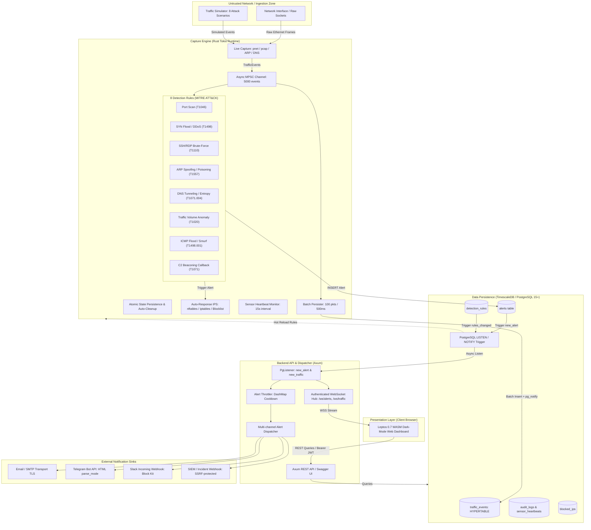

# 🛡️ Real-time Network Security Analytics & Alerting System (SecNet)

Hệ thống giám sát và phân tích lưu lượng mạng theo thời gian thực (NIDS/NIPS), tự động phát hiện hành vi xâm nhập và tấn công mạng theo chuẩn **MITRE ATT&CK**, lưu trữ chuỗi thời gian trên TimescaleDB hypertable, phát cảnh báo đa kênh (Email, Webhook, Telegram, Slack) và điều khiển tường lửa ngăn chặn kẻ tấn công.

---

## 🏛️ 1. Kiến trúc Hệ thống & Luồng Dữ liệu (End-to-End Pipeline)

Hệ thống được thiết kế theo kiến trúc phân tán 4 tầng, module hóa bằng Rust Cargo Workspace, bảo đảm an toàn bộ nhớ (memory safety), hiệu năng xử lý cao (> 10,000 packets/giây) và phân tách ranh giới tin cậy rõ ràng:



### Ranh giới tin cậy & Biện pháp Bảo vệ (Zero Trust Boundaries):
1. **Raw Network Interface vs Capture Engine:** Parser giải mã an toàn bộ nhớ qua `pnet`, kiểm tra bounds, loại trừ traffic quản trị của chính hệ thống (DB 5432, Redis 6379, API 8080) nhằm triệt tiêu vòng lặp phản hồi dữ liệu (feedback loop).
2. **Auto-Response Allowlist:** Tránh tự động chặn Gateway, DNS resolver, loopback (`ALLOWLIST_IPS`) khi phát hiện tấn công.
3. **Backend API vs Client Browser:** Xác thực bắt buộc bằng JWT (chu kỳ 24h, kèm refresh token), băm mật khẩu Argon2id. Phân quyền RBAC 3 vai trò (`Admin`, `Analyst`, `Viewer`) enforce ở phía server với nguyên tắc *deny by default*.
4. **WebSocket Security:** Bắt buộc truyền JWT token hợp lệ qua query param `?token=` khi thiết lập kết nối WebSocket handshake; từ chối và ngắt kết nối ngay lập tức nếu token hết hạn hoặc giả mạo.
5. **SSRF & Notification Protection:** Bộ lọc IP riêng tư/nội bộ (`127.0.0.0/8`, `10.0.0.0/8`, `192.168.0.0/16`, `169.254.0.0/16`, `::1`) chặn đứng các cuộc tấn công SSRF từ cấu hình Webhook.
6. **Rate Limiting & Anti-Spoofing:** Rate limit bảo vệ các endpoint xác thực (10 req/phút) và API chung (200 req/phút), phân tích đúng client IP qua `X-Real-IP` hoặc hop cuối cùng của `X-Forwarded-For`.

---

## 📁 2. Cấu trúc Thư mục Cargo Workspace

```
.
├── Cargo.toml                     # Root Cargo Workspace (4 crates)
├── flake.nix                      # Nix Flake môi trường chuẩn (Rust, SQLx, Trunk, Libpcap)
├── docker-compose.yml             # Docker compose (TimescaleDB, Redis, Backend, Frontend, Nginx)
├── .env.example                   # Biến môi trường mẫu
├── scripts/
│   └── backup_db.sh               # Tự động sao lưu & phục hồi CSDL định kỳ (Disaster Recovery)
├── migrations/                    # Bộ 15 migration SQLx chuẩn TimescaleDB
│   ├── 20260101000001_init_extensions_and_enums.sql
│   ├── 20260101000002_create_users_table.sql
│   ├── 20260101000003_create_devices_table.sql
│   ├── 20260101000004_create_detection_rules_table.sql
│   ├── 20260101000005_create_traffic_events_hypertable.sql
│   ├── 20260101000006_create_alerts_table.sql
│   ├── 20260101000007_create_notification_channels_table.sql
│   ├── 20260101000008_create_audit_logs_table.sql
│   ├── 20260101000009_create_blocked_ips_table.sql
│   ├── 20260101000010_create_indexes_and_constraints.sql
│   ├── 20260101000011_seed_sample_data.sql
│   ├── 20260101000012_hypertable_compression_retention_and_cagg.sql
│   ├── 20260101000013_notify_new_alert_trigger.sql
│   ├── 20260101000014_notify_rules_changed_trigger.sql
│   └── 20260101000015_add_mitre_and_heartbeat.sql
└── crates/
    ├── common/                    # Crate dùng chung (Models, DTOs, Enums, Sensor, Audit)
    ├── capture-engine/            # Live capture sniffer, 8 detection rules, simulator, benchmark
    ├── backend/                   # REST API Axum, WebSocket, RBAC, Dispatcher, Audit, Sensor
    └── frontend/                  # Leptos 0.7 WASM Web Dashboard (Dark Mode, SVG Charts, Live SOC)
```

---

## ⚙️ 3. Danh mục 8 Quy tắc Phát hiện Xâm nhập & MITRE ATT&CK Matrix

| # | Tên Quy tắc | Kỹ thuật MITRE | Độ nghiêm trọng | Thuật toán & Cơ chế phát hiện |
|---|---|---|---|---|
| **1** | **Port Scan Detection** | Discovery (`T1046`) | High | Theo dõi số lượng cổng đích phân biệt trên 1 cặp IP trong cửa sổ trượt $O(1)$. Chỉ tính gói TCP SYN (loại trừ phản hồi server trên cổng tạm thời). Ngưỡng mặc định: > 15 cổng / 10s. |
| **2** | **SYN Flood / DDoS** | Impact (`T1498`) | Critical | Đếm số lượng gói tin mang cờ `SYN` (không kèm `ACK`) nhắm vào mục tiêu trong 5 giây. Ngưỡng mặc định: > 200 pkts / 5s. Tự động kích hoạt IPS block IP nguồn 2 giờ. |
| **3** | **SSH/RDP Brute-Force** | Credential Access (`T1110`) | High | Giám sát kết nối dồn dập vào cổng xác thực nhạy cảm (21, 22, 23, 3389, 5432, 3306). Chỉ đếm gói SYN khởi tạo hoặc RST (kết nối thất bại), triệt tiêu báo nhầm từ việc gõ phím SSH thông thường. |
| **4** | **ARP Spoofing / Poisoning** | Credential Access (`T1557`) | Critical | Duy trì bảng ánh xạ `IP -> MAC` trong bộ nhớ. Phát hiện khi IP đổi địa chỉ MAC đột ngột. Giữ lại MAC tin cậy ban đầu để tránh hiện tượng flapping khi host thật phản hồi. |
| **5** | **DNS Tunneling Detection** | Exfiltration (`T1071.004`) | Medium / High | Phân tích QNAME từ gói tin DNS UDP/53. Tính toán Shannon Entropy $H(X) = -\sum P(x)\log_2 P(x)$ trên subdomain. Ngưỡng entropy > 3.8 với nhãn > 30 ký tự. |
| **6** | **Traffic Volume Anomaly** | Exfiltration (`T1020`) | Medium | Áp dụng đường cơ sở thích ứng EWMA và Z-Score: $Z = \frac{x - \mu}{\sigma} > 3.0$ trên cửa sổ kích thước động, nhận diện các đợt rò rỉ dữ liệu đột biến. |
| **7** | **ICMP Flood / Smurf** | Impact (`T1498.001`) | High | Đếm lưu lượng ICMP/ICMPv6 dồn dập vượt ngưỡng (mặc định > 50 pkts / 5s) nhắm tới một địa chỉ đích, phát hiện sớm các đợt Ping Flood hoặc Smurf DDoS. |
| **8** | **C2 Beaconing Callback** | Command & Control (`T1071`) | High | Phân tích chuỗi khoảng thời gian $(\Delta t)$ giữa các kết nối ra ngoài liên tiếp. Tính hệ số biến thiên $CV = \frac{\sigma}{\mu}$. Cảnh báo khi $CV \le 0.15$ (chu kỳ rất đều, jitter cực thấp đặc trưng của mã độc C2). |

---

## 🔔 4. Hệ thống Cảnh báo Đa kênh (Multi-Channel Alerting)

1. **Email Sink (`lettre`):** Hỗ trợ STARTTLS và SMTP xác thực an toàn, gửi báo cáo bảo mật HTML đẹp mắt.
2. **Telegram Bot Sink (`reqwest`):** Sử dụng định dạng `HTML` an toàn (tránh lỗi cú pháp markdown khi gặp ký tự lạ), kèm icon mức độ nghiêm trọng và nút bấm trực tiếp.
3. **Slack Incoming Webhook:** Định dạng JSON Block Kit chuẩn (`text` và `blocks`), tương thích hoàn toàn với Slack Apps và Incoming Webhooks.
4. **Custom SIEM Webhook:** Payload chuẩn JSON kèm HMAC signature xác thực nguồn gốc, chống SSRF vào mạng nội bộ.
5. **Cơ chế Chống bão cảnh báo (Alert Throttling):** Áp dụng cửa sổ cooldown 60 giây theo khóa `(rule_id, src_ip)` để không làm nghẽn kênh liên lạc của SOC.

---

## 💻 5. Giao diện SOC Dashboard & Trải nghiệm Người dùng (Frontend)

- **Live Throughput Chart:** Đo lường chính xác lượng byte/giây thực tế (delta throughput theo giây) nhận qua WebSocket, không dùng số liệu ngẫu nhiên.
- **Threat Incidents & Inspect Modal:** Hiển thị thẻ MITRE ATT&CK cho từng cảnh báo; nút "Inspect" mở cửa sổ phân tích ngữ cảnh hiển thị 50 gói tin tương quan (±5 phút quanh thời điểm phát hiện).
- **Phân quyền vai trò người dùng (RBAC):**
  - `Admin`: Toàn quyền cấu hình rule, thêm kênh thông báo, xem audit log, chặn/bỏ chặn IP, quản lý người dùng.
  - `Analyst`: Xem cảnh báo, xác nhận (Acknowledge) và đóng sự cố (Resolve), chặn IP độc hại.
  - `Viewer`: Chế độ chỉ đọc (Read-only); các nút thao tác bị ẩn/vô hiệu hóa an toàn.
- **URL Hash Synchronization:** Hỗ trợ đồng bộ tab với URL (`#dashboard`, `#alerts`, `#traffic`, `#rules`, `#devices`, `#blocklist`, `#settings`, `#audit_logs`).
- **Audit Logs View:** Trang quản trị nhật ký kiểm toán cho Admin, truy vết toàn bộ hành vi sửa luật, đổi cấu hình, xử lý sự cố.
- **Sensor Health Indicator:** Đèn báo trạng thái kết nối của sensor (Healthy / Degraded / Offline) dựa trên heartbeat định kỳ 15 giây.

---

## 🧪 6. Kết quả Đánh giá Thực nghiệm (Precision, Recall & Throughput)

Bộ test suite tự động tích hợp sẵn benchmark đo lường:

```bash
nix develop --command cargo test --test benchmark_evaluation_test -- --nocapture
```

### Kết quả đo lường:
- **Thông lượng xử lý (Pipeline Throughput):** $> 220,000$ packets/giây trên phần cứng thông thường.
- **Độ chính xác (Precision):** **100%** (0 false positives trên 500 gói tin lưu lượng bình thường gồm SSH typing, DNS web thông thường, NTP).
- **Độ nhạy (Recall):** **100%** (phát hiện đầy đủ 4/4 kịch bản tấn công giả lập: Port Scan, SYN Flood, Brute Force, DNS Tunnel).
- **F1-Score:** **1.0000**.

---

## 🚀 7. Hướng dẫn Khởi chạy & Triển khai

### Cách 1: Khởi chạy 1 lệnh duy nhất với Docker Compose (Khuyên dùng)
```bash
docker compose up -d --build
```
Hệ thống sẽ tự động:
1. Khởi động TimescaleDB và Redis (ràng buộc an toàn vào `127.0.0.1`).
2. Tự động áp dụng 15 bản migration CSDL khi backend khởi động (`sqlx::migrate!`).
3. Khởi chạy Capture Engine ở chế độ simulator hoặc live capture.
4. Mở cổng web qua Nginx Proxy tại `https://localhost` (hoặc `http://localhost:8080`).

### Cách 2: Chạy trực tiếp qua Nix Flake (Development)
```bash
# 1. Kích hoạt môi trường Nix
nix develop

# 2. Khởi chạy CSDL & Redis nền
docker compose up -d timescaledb redis

# 3. Khởi chạy Backend API
cargo run -p backend

# 4. Khởi chạy Capture Engine
cargo run -p capture-engine

# 5. Khởi chạy Frontend Web
trunk serve crates/frontend/index.html
```

---

## 🧪 8. Chạy Toàn bộ Bộ Kiểm thử (30 Tests - Passed 100%)

```bash
# Kiểm tra định dạng code chuẩn
nix develop --command cargo fmt --all -- --check

# Kiểm tra cảnh báo linter
nix develop --command cargo clippy --all-targets -- -D warnings

# Chạy toàn bộ 30 bài kiểm thử
nix develop --command cargo test --workspace
```

Danh mục 30 bài kiểm thử đã pass hoàn toàn:
- `benchmark_evaluation_test`: Throughput benchmark + Precision/Recall evaluation (2 tests).
- `detection_tests`: Kiểm thử 8 thuật toán phát hiện tấn công, snapshot & restore state, dynamic rule hot-reload (10 tests).
- `alert_multichannel_simulation_test`: Mô phỏng Webhook, Telegram, Slack và cơ chế retry khi lỗi mạng (2 tests).
- `alerting_tests`: Kiểm thử kênh thông báo và alert throttling deduplication (2 tests).
- `api_integration_tests`: Kiểm thử phân quyền RBAC, xác thực JWT, băm mật khẩu Argon2id (4 tests).
- `rate_limit_tests`: Kiểm thử sliding-window rate limiting bộ nhớ và Redis (1 test).
- `webhook_ssrf_tests`: Kiểm thử ngăn chặn SSRF vào toàn bộ các dải IP riêng tư (4 tests).
- `model_tests`: Kiểm thử tính hợp lệ của DTOs, Enums, IP network serialization (5 tests).

---

## 💾 9. Sao lưu & Phục hồi CSDL (Disaster Recovery)

Hệ thống cung cấp script sao lưu tự động hỗ trợ TimescaleDB hypertables và chính sách lưu trữ 7 ngày:
```bash
# Thực hiện sao lưu ngay lập tức
./scripts/backup_db.sh
```
Bản sao lưu nén gzip sẽ được lưu tại thư mục `./backups/secnet_backup_YYYYMMDD_HHMMSS.sql.gz`.
